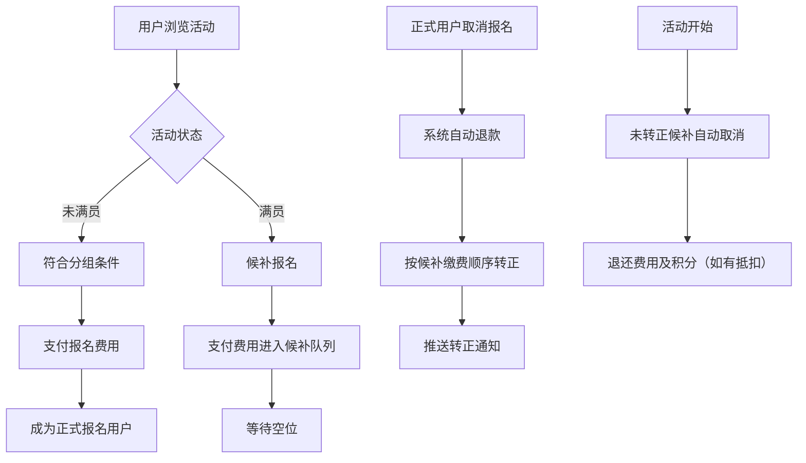
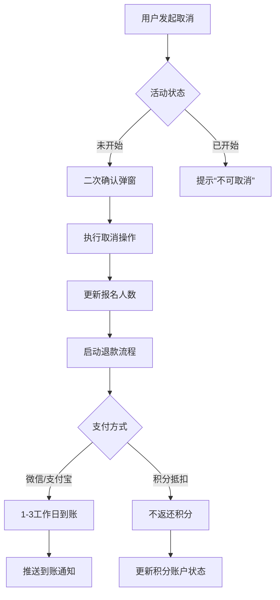

# GoUp 活动会员管理系统需求文档

## 一、系统概述

### 1. 系统定位

面向多语言、志愿及主题活动的全流程管理平台，支持用户报名参与、管理员统筹运营，核心实现 “活动管理 - 报名支付 - 会员服务 - 数据统计” 闭环。

### 2. 核心模块

* 前端用户端：覆盖活动浏览、报名、支付、个人中心管理等用户操作场景

* 后台管理端：包含活动配置、会员管理、数据统计、规则设置等运营功能

* 数据交互层：确保前后端数据实时同步，支撑报名状态、支付结果、积分等核心数据流转

## 二、前端用户端需求

### 1. 基础导航

* **底部导航栏**：固定展示 “来玩”“我的” 两个核心入口，图标 + 文字组合样式，选中状态有视觉区分（如颜色加深、下划线），适配不同机型高度（使用 rpx 单位 + 安全区域填充）

* **页面跳转**：点击 “来玩” 进入活动列表页，点击 “我的” 进入个人中心页，所有页面顶部均设 “返回” 按钮，保留上一级页面状态

### 2. 活动列表页（“来玩” 模块）

#### （1）分类筛选

* 初始化展示 5 个基础分类：汉语、英语、小语种、志愿、主题，支持管理员新增分类同步展示

* 分类以色块图标形式呈现，点击后筛选对应分类活动，顶部显示 “当前分类：XX” 标签

#### （2）搜索与排序

* 顶部搜索框：支持按活动标题 / 地点关键词搜索，无结果时显示 “未找到相关活动” 及清除按钮

* 排序规则：置顶活动（带 “置顶” 标签）优先展示，后续按发布时间倒序排列

#### （3）活动卡片展示

* 左侧：活动主图缩略图（16:9 比例，适配列表展示）

* 右侧：标题（超出部分用 “...” 省略）、时间（格式：YYYY-MM-DD HH:MM）、地址（简洁显示）、报名进度（“已报名 X 人 / 最大 Y 人”）

* 交互：点击卡片任意区域跳转至活动详情页

### 3. 活动详情页

#### （1）页面结构

* **顶部**：全屏主图（支持多图滑动），叠加 “热点”“置顶” 等属性标签

* **中部信息区**：

  * 标题：自动换行，无字数限制，按 UI 字号展示

  * 基础信息：时间（开始 - 结束时段）、地点（支持点击跳转地图导航）

  * 报名信息：已报名用户国旗图标横向排列（最多 8 个，超出显示 “+X”）、报名进度条（含剩余名额）

* **底部功能区**：固定在页面底部，左右分栏布局

  * 左侧 “分享活动”：图标 + 文字样式，点击触发微信小程序分享（预设主图、标题、时间、地址）

  * 右侧 “报名（显示价格）”：按钮样式，显示 “报名 ¥XX” 或 “免费报名”，按状态动态变化

#### （2）状态交互规则

| 活动状态     | 按钮显示内容        | 交互效果        |
| -------- | ------------- | ----------- |
| 未满员且可报名  | 报名 ¥XX / 免费报名 | 点击进入支付界面    |
| 满员候补     | 候补报名 ¥XX      | 弹窗提示后进入支付界面 |
| 已报名      | 已报名           | 置灰，点击无响应    |
| 已结束 / 取消 | 活动已结束         | 置灰，点击无响应    |

### 4. 支付界面

#### （1）支付方式展示

* 卡片式布局，依次展示：

  * 微信支付：绿色图标 +“微信支付” 文字

  * 支付宝支付：蓝色图标 +“支付宝支付” 文字

  * 积分抵扣：在订单页选择固定档位抵扣（6 档：1000→1 元、5000→5 元、10000→10 元、15000→15 元、20000→20 元、50000→50 元），显示所需积分与可抵扣金额；若所选档位的抵扣金额 ≥ 订单金额，则可仅使用积分支付。

#### （2）交互与校验

* 支付方式选择：选择微信或支付宝作为现金支付方式；积分抵扣在订单页直接选择固定档位。

* 支付反馈：成功跳转至报名状态页，失败显示原因及重试按钮

* 规则同步：订单金额为整数（元）；展示应付现金与抵扣金额；仅积分支付时现金为 0。

### 5. 个人中心页（“我的” 模块）

#### （1）顶部用户卡片

* 展示头像、英文名、会员分组标签（如 “中国人 / 女”），点击进入个人信息编辑页

#### （2）功能列表

1. **个人信息编辑**

* 可编辑项：语言、职业、城市、喜欢的活动类型

* 不可编辑项：性别、年龄、国籍、身份证件号（部分字符隐藏）

* 交互：保存后实时更新用户卡片信息，弹窗提示 “修改成功”

1. **活动报名状态查询**

* 筛选栏：支持 “已报名”“候补” 分类筛选

* 列表项：主图、标题（可跳转详情）、状态标签（已报名 - 绿色 / 候补 - 黄色 + 排名）、时间地点、“取消报名” 按钮（活动开始前显示）

1. **取消的活动及退款记录**

* 按取消时间倒序排列，展示活动标题、取消时间、原状态、退款金额（含支付方式）、退款状态（退款中 / 已到账 / 失败）

* 交互：点击记录查看详情，退款失败显示 “联系客服” 按钮

1. **积分账户**

* 顶部显示可用总积分与近 30 天新增积分

* 账户明细：展示积分获取（活动积分 / 裂变积分）与积分支付记录，支持时间筛选

* 暂无积分时提示 “暂无积分，可参与活动或邀请好友获取”

1. **密码修改**

* 三步表单：当前密码→新密码（8-20 位含字母 + 数字）→确认新密码

* 交互：密码可见切换，修改成功后提示并跳转登录页

## 三、后台管理端需求

### 1. 活动管理模块

#### （1）分类管理

* 初始化配置：自动创建汉语、英语、小语种、志愿、主题 5 个基础分类，设 “不可删除” 保护

* 维护功能：

  * 新增：输入名称、上传图标、设置排序权重，实时同步至前端

  * 编辑：修改名称、图标、排序，支持调整前端展示顺序

  * 删除：仅允许删除自定义分类，需校验无关联活动

#### （2）活动创建与编辑

| 字段   | 配置方式                                     | 校验规则         |
| ---- | ---------------------------------------- | ------------ |
| 所属分类 | 下拉多选框                                    | 至少选择 1 个分类   |
| 主图   | 上传 + 裁剪，支持多图                             | 适配前端 16:9 比例 |
| 标题   | 单行输入，无字数限制                               | 建议不超过 30 字   |
| 时间   | 日期 + 时间选择器（开始 + 结束）                      | 结束时间 > 开始时间  |
| 地点   | 输入框 + 地图选址                               | 可选填          |
| 报名分组 | 多选框（外国人 / 中国人 / 男 / 女 / 未成年）             | 至少选择 1 个分组   |
| 报名人数 | 最大人数（必填，≥1）、最小人数（选填，≤最大人数）、候补名额（选填 / 不限） | 最小≤最大，候补名额≥0 |
| 活动内容 | 富文本编辑器（文字 / 图片 / 列表 / 链接）                | 适配移动端展示      |
| 报名金额 | 数字输入（整数金额，单位元；支持 0 元）                        | 非负整数         |

#### （3）活动状态管理

* 状态类型：草稿、待发布、已发布、已结束、已取消

* 操作逻辑：

  * 发布：实时同步至前端展示

  * 结束 / 取消：关闭前端报名入口，候补自动取消并退款

  * 满员提醒：可设置 “报名达 90%” 推送通知给管理员

### 2. 会员管理模块

#### （1）会员列表

* 展示字段：用户 ID、英文名、性别、年龄、国籍（国旗图标）、注册时间、分组、累计参与次数

* 操作功能：

  * 查看详情：浏览完整信息、报名记录、积分账户、积分流水

  * 编辑分组：手动调整会员标签（如 “核心会员”“志愿者”）

  * 禁用账号：违规用户可临时 / 永久禁用，前端提示 “账号受限”

#### （2）会员标签管理

* 支持自定义标签创建，可关联活动报名分组（如 “仅志愿者标签可报名”）

### 3. 数据统计模块

#### （1）活动参与统计

* 维度：

  * 单活动：报名人数、实际到场人数（手动录入签到）、参与率、评价汇总

  * 用户：个人参与记录、活跃度排名（累计 / 近 30 天参与次数）

  * 全局：日 / 周 / 月趋势图、分类占比柱状图、时段参与分布

* 功能：时间范围筛选、Excel / 图片导出、每周自动生成报表

#### （2）支付统计

* 总览指标：总交易金额、平均客单价、支付方式占比

* 明细管理：支付记录（订单号、用户、金额、方式、状态）、退款记录（关联取消报名数据）

* 异常监控：标记高频退款、同一 IP 多笔支付等行为

#### （3）积分统计

* 趋势指标：积分新增 / 消耗趋势（按日 / 周 / 月），可按活动分类与来源类型（活动积分 / 裂变积分）筛选

* 榜单分析：裂变积分来源榜单（推荐人 TOP、裂变贡献值），支持时间范围筛选与导出

* 明细管理：积分流水（获取 / 抵扣 / 调整 / 结算；退款不触发积分返还），支持导出 Excel / 图片

* 异常监控：短时大量积分获取、重复结算等异常行为标记与通知

### 4. 规则设置模块（积分与裂变积分）

#### （1）积分支付规则

* 支持订单页积分抵扣，提供 6 个固定档位（1000→1 元、5000→5 元、10000→10 元、15000→15 元、20000→20 元、50000→50 元）。
* 组合支付：现金（微信/支付宝）+ 积分抵扣；若抵扣金额 ≥ 订单金额，则支持仅使用积分支付。
* 使用限制：积分余额不足所选档位时不可用；每单仅可选择一个档位。

#### （2）积分获取规则（活动积分）

* 获取方式：会员每参加活动，使用微信支付或支付宝支付，每 1 元获取 10000 积分

* 示例：支付 10 元获取 100000 积分；支付 0 元不获取积分

* 说明：积分与支付金额线性相关，不足 1 元按实际金额比例计算

#### （3）裂变积分规则

* 邀请机制：会员分享小程序给好友，好友使用该会员的邀请码注册成为新会员

* 裂变积分：被邀请的新会员每次参加活动并通过微信 / 支付宝支付，推荐会员按订单金额每 1 元获得 100 积分（裂变积分，按每个订单幂等一次）；新会员按“活动积分”规则获取其积分

* 绑定关系：邀请人与被邀请人通过邀请码建立推荐关系；可在后台查看推荐链路与积分明细

#### （4）测试功能

* 模拟支付金额、积分累积与抵扣金额计算，验证规则有效性（含裂变积分）

#### （5）结算与入账

* 入账时间：不管是活动积分还是裂变积分，均在会员支付费用后、活动结束后 30 分钟，系统自动计算并累积到会员的积分账户

* 取消情况：活动开始前取消报名的订单不产生积分；无积分抵扣规则

#### （6）后台配置页展示

* 积分抵扣档位（只读）：展示 6 档抵扣选项（1000→1 元、5000→5 元、10000→10 元、15000→15 元、20000→20 元、50000→50 元），与前端保持一致

* 结算策略说明：说明入账时间（活动结束后 30 分钟入账）、取消与退款规则（取消不产生积分、已抵扣不返还）

* 权限与审计：仅管理员可见；展示配置变更历史与版本号（可选）

* 配置来源：从系统规则配置读取，该页面仅做展示，不在此页修改

## 四、核心业务流程

### 1. 活动报名 - 候补 - 转正流程

### 2. 取消报名与退款流程

## 五、设计开发规范

### 1. UI 适配要求

* 单位：统一使用 rpx 适配不同机型

* 底部内容：用 scroll-view 包裹并设置 padding-bottom，避免被导航栏遮挡

* 安全区域：iPhoneX 系列机型适配 safe-area-inset-bottom 环境变量

### 2. 数据交互规范

#### （1）核心接口清单

| 接口功能   | 请求方式 | 接口地址                             |
| ------ | ---- | -------------------------------- |
| 获取分类列表 | GET  | /api/category/list               |
| 创建活动   | POST | /api/activity/create             |
| 获取活动列表 | GET  | /api/activity/list?categoryId=xx |
| 用户报名   | POST | /api/activity/signup             |
| 取消报名   | POST | /api/user/activity/cancel        |
| 获取个人信息 | GET  | /api/user/info                   |
| 修改密码   | POST | /api/user/change-password        |
| 获取支付统计 | GET  | /api/stat/payment                |

| 积分账户查询 | GET  | /api/points/account              |
| 积分结算任务 | POST | /api/points/settlement/run       |
| 裂变关系绑定 | POST | /api/referral/bind               |

#### （2）数据校验原则

* 前端预校验：报名分组匹配、密码格式、支付金额等

* 后台强校验：并发报名防超员、退款状态同步、规则逻辑执行

### 3. 状态提示规范

* 操作反馈：报名、取消、退款等关键操作均需弹窗 / 推送通知

* 状态标签：统一颜色标准（已报名 - 绿、候补 - 黄、满员 - 红、退款中 - 橙）

* 异常提示：明确失败原因（如 “名额已被抢占”“密码不正确”）